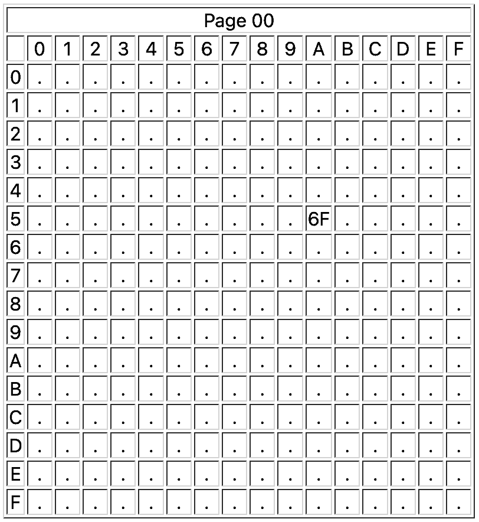
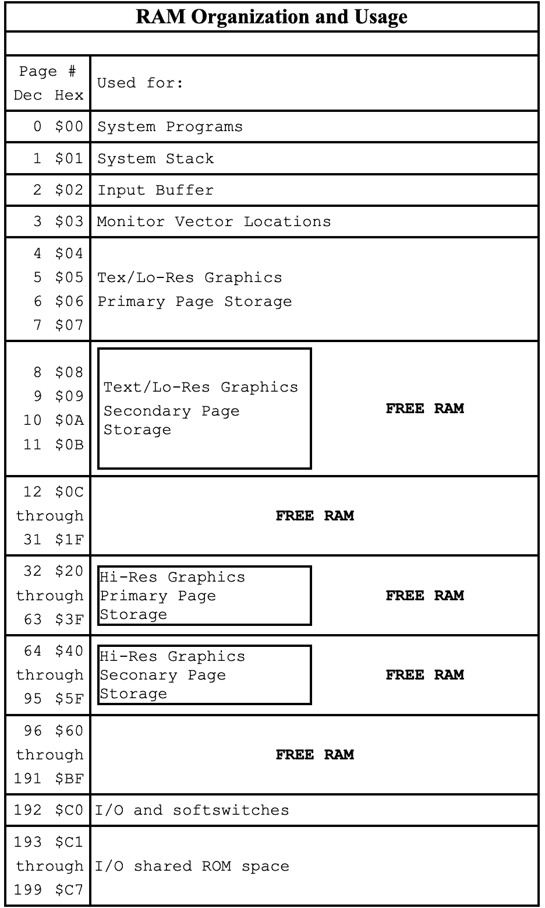

# Part 3: The Apple II

## Hardware and Firmware

![An Apple II in a typical 1977 configuration [1] ](images/apple-ii-system.jpg)

No hacker is completely satisfied with a project he is working on as long as it is possible to make improvements that make it better in some way. After Wozniak had completed design on the Apple-1, he already had in mind enhancements that would make his computer faster and more functional. He wanted to make it display in color. He worked to combine the terminal and memory functions of the Apple-1 by moving the display into main memory, allowing instant screen changes. None of these modifications were made specifically to make it a better product, or to make it more attractive for a customer to purchase. Wozniak stated:

> A lot of features of the Apple II went in because I had designed Breakout for Atari. I had designed it in hardware. I wanted to write it in software now. So that was the reason that color was added in first -- so that games could be programmed. I sat down one night and tried to put it into BASIC. Fortunately I had written the BASIC myself, so I just burned some new ROMs with line drawing commands, color changing commands, and various BASIC commands that would plot in color. I got this ball bouncing around, and I said, "Well it needs sound," and I had to add a speaker to the Apple II. It wasn't planned, it was just accidental... Obviously you need paddles, so I had to scratch my head and design a simple minimum-chip paddle circuit, and put on some paddles. So a lot of these features that really made the Apple II stand out in its day came from a game, and the fun features that were built in were only to do one pet project, which was to program a BASIC version of Breakout and show it off at the club. [2]

Wozniak added other features that he felt were important for a computer that was useful, one that he would want to own. Since the 6502 processor could address a total of 64K of memory, he designed the computer with the ability to use either 4K RAM chips, or the newer (and more expensive) 16K RAM chips. The first Apple II's came standard with 4K of memory, and more could be added, to a maximum of 12K (if using the 4K chips) or 48K (if using the 16K chips). Specially wired strapping blocks attached to the motherboard told the Apple II how much memory was present and where it was. According to the 1981 edition of the "Apple II Reference Manual", the Apple could have memory in the following sizes: 4K, 8K, 12K,16K, 20K, 24K, 32K, 36K, or a full 48K. These sizes were determined by the different ways that three RAM chips, either 4K or 16K, could be installed. The strapping blocks were even designed with the flexibility of allowing blank spots in memory if there were no RAM chips available to fill those spots.

![Apple II RAM array [3] ](images/apple-ii-ram.jpg)

The first 4K of memory always had to have RAM present, since it was used by the 6502 processor, the ROM routines, and the text screen display. If, for example, you only had two other 4K RAM chips to install and you wanted to display hi-res graphics, you could strap one chip to the lower half of hi-res memory from $2000-$2FFF, and the other to the upper half of hi-res memory from $3000-$3FFF. [4] Since 16K RAM chips cost about $500 when Wozniak designed the Apple II, not many users could afford them. Whereas the Commodore PET and the Radio Shack TRS-80 could not easily be expanded beyond the 4K they came with, the Apple II from the beginning was designed with expansion in mind. [5]

The row of eight expansion slots was another feature about the Apple II that was a strong selling point. Unlike the TRS-80 or PET, you could easily expand the Apple II by simply plugging a card into one of these slots. This degree of expandability made it more expensive to build, however. Steve Jobs didn't believe that anyone would ever need more than two slots, one for a printer and one possibly for a modem. Wozniak knew from his experience with computers at Hewlett-Packard that computer uses would always find "something" to fill those extra slots, and insisted that they keep the number at eight. [6]

One problem Apple had to deal with was getting FCC approval for the computer. The RF (radio frequency) modulator that had been designed gave off too much interference, and it was probable that the FCC would not approve it. (The RF modulator allowed a user to attach the Apple to a standard television receiver, instead of requiring the purchase of an expensive computer monitor). Rather than have the release of the Apple II delayed for re-engineering of the RF modulator to get that FCC approval, Apple gave the specifications for the RF modulator to Marty Spergel. He ran a small company (called M&R Electronics) that specialized in obtaining hard-to-get parts that electronics and computer hackers wanted for their projects. Their agreement allowed M&R to make and sell the RF modulators, while Apple could concentrate on making and selling the Apple II. Dealers would sell an Apple II with a "Sup'R'Mod II" (costing about $30) if the buyer wanted to see the graphics on their color TV. Jobs assured Spergel that the item would sell well, maybe as many as fifty units a month. (Years later Spergel estimated that he had sold about four hundred thousand Sup'R'Mods). [7]

![Sup'R'Mod II RF Modulator [8] ](images/sup-r-mod.jpg)

Other features that Wozniak (and Allen Baum, who helped him with the project) included in the Apple II ROMs included the terminal software to do screen text display, expanded Monitor functionality, and cassette input/output routines. They added the ability to split the screen into different sized windows. They also wrote a disassembler, which was one of the most important features of the Apple II from the beginning and a significant part of its open design. It allowed "anyone" to view the 6502 code that "any" program used, and matched the philosophy of the Homebrew Club of making all computer knowledge available to everybody. In the Apple-1 days, when Apple was supplying software "free or at minimal charge", Wozniak and Baum published an early version of their 6502 disassembler in a hacker's magazine. It was designed to be loaded in memory on the Apple-1 from $800 to $9D8 and the routine could be executed from the monitor. This early code was quit similar to the disassembler that was later included in the Apple II ROM. [9]

Having an expanded Monitor program in ROM and color graphics were not the only features in the Apple II that attracted people to it. Having Wozniak's BASIC language in ROM, available immediately when the power was turned on, made it possible for non-hackers to write programs that used the Apple II's color graphics.

An interesting bit of trivia about Wozniak's Integer BASIC was that he never had an assembly language source file for it. He wrote it in machine language, assembling it by hand on paper:

> I wrote this BASIC processor, and I wrote a little ALGOL simulator and got it simulated. It looked like it would work, but I had forgotten to build the machine. I had no assembler, that was another thing. To use an assembler, they figured that somebody was going to buy this processor [the 6502] to use for a company, and their company can pay a few thousand dollars in time-sharing charges to use an assembler that was available in time-share. I didn't have any money like that, so a friend taught me that you just sort of look at each instruction, you write your instructions on the right side of the page, you write the addresses over on the left side, and you then look up the hex data for each instruction--you could assemble it yourself. So I would just sit there and assemble it myself. The [Integer] BASIC, which we shipped with the first Apple II's, was never assembled--ever. There was one handwritten copy, all handwritten, all hand-assembled. So we were in an era that we could not afford tools. [10]

Even to this day there is not an official source code listing of Integer BASIC at Apple. One of the few errors I am aware of in the Integer interpreter is one involving a single byte. If a line is entered that has too many parentheses, the "TOO LONG" error message is displayed instead of the "TOO MANY PARENS" message. [11] Also, if a FOR - NEXT loop was nested (that is, had a FOR - NEXT loop within another FOR - NEXT loop), and if the program repeated entered the beginning of the loop without hitting the NEXT statement, it would eventually cause a crash. [16]

## Memory Map

To understand the memory layout of the Apple II, consider this analogy: Imagine a cabinet with sixteen shelves, and sixteen separate slots or pigeon holes on each shelf (similar to those found in old roll-top desks). Each slot refers to a specific address in memory on the computer, and each slot can hold a number between 0 and 255. (Since a byte is eight bits wide, the largest number that can be represented by eight binary bits is 255). The top shelf is row "0", and the leftmost slot in that row is slot "0". The address of that slot, then, is $00. As we move to the right, the addresses increase, $01, $02, $03, and so on to $0F at the end. We then go down to the next row, (row "1"), and the addresses continue in the same fashion with $10, $11, $12, and so on as before. The sixteenth row is row "F", the rightmost slot in that row is slot "F", and the address of that slot is $FF. This cabinet has, then, 256 slots (16 x 16), and represents what is called a "page" in the Apple memory. The cabinet itself has an address (since computers need addresses for everything), and this one's address is "00". The full address of row "5", slot "A" on cabinet "00" is $005A, and the value that is at that location (in this example) is "6F".

Only the Altair 8800 came with just 256 bytes of memory, so we have to account for the entire 64K memory space that the 6502 chip in the Apple II can handle. There is a cabinet sitting on top of cabinet "00", and it is laid out in the same fashion with its 256 slots in sixteen rows. This is cabinet "01", and on top of that one is cabinet "02"; this continues on up until we reach cabinet "FF" way up at the top. Apple programmers refer to these cabinets as "pages" of memory. There are 256 pages of memory, each with 256 bytes on a page, making a grand total of 256 x 256 = 65536 bytes of memory (or slots that can hold a number, if you prefer the analogy).

In discussing the memory map on the Apple II, we can refer to pages of memory with a hexadecimal two-digit number for shorthand if we wish. The general layout of the Apple II memory is as follows:

* Page $00: Used by the 6502 processor for storage of information that it can access quickly.  This is prime real-estate that is seldom available for general use by programmers without special care.
* Page $01: Used by the 6502 for internal operations as a "stack."
* Page $02: Used by the Apple II firmware as an input buffer when using the keyboard from BASIC, or when a program uses any of the firmware input routines.
* Page $03: General storage area, up to the top three rows (from $3D0 through $3FF) which are used by the disk operating system and the firmware for pointers to internal routines.
* Pages $04-$07: Used for the 40 column text screen.
* Pages $08-$BF: Available for use by programs, operating systems, and for hi-res graphics.  Within this space, Woz designated pages $08-$0A as a secondary text and lo-res graphics page (although it was not easy to directly use, as the firmware did not support it), pages $20-$3F for hi-res "page" one, and pages $40-$5F for hi-res "page" two.
* Page $C0: Internal I/O and softswitches
* Pages $C1-$C7: ROM assigned to each of the seven peripheral cards
* Pages $C8-$CF: Switchable ROM available for each of the seven cards
* Pages $D0-$D7: Empty ROM socket #1
* Pages $D8-$DF: Empty ROM socket #2
* Pages $E0-$F7: Integer BASIC ROM
* Pages $F8-$FF: Monitor ROM

The memory space on the Apple II between $C000 and $CFFF was assigned to handle input and output. From $C000 to $C0FF the space was reserved for various soft-switches used to control the display, and various built-in I/O devices, such as the keyboard, paddles, annunciators, and the cassette port. (A soft-switch is simply a memory location that, when a number is stored there, changes something in the computer--such as switching on graphics mode). From $C100 to $CFFF the space was reserved for ROM on the plug-in peripheral cards for each of the seven slots. Slot 1 was given the space from $C100 to $C1FF, slot 2 from $C200 to $C2FF, and so on. The $C800 to $CFFF space was special slot-selectable ROM that was uniquely available for each of the seven peripheral cards. For example, a program running on the card in slot 6 to control a device could use the $C800-$CFFF space for its own purpose. When control passed to the card in slot 3, that card could use a program of its own that ran in the same $C800-$CFFF space. This was accomplished by allowing each card to have ROM code that covered pages $C8-$CF, and making that space "switchable", depending on which card wanted to use it. Having this space available made writing ROM code simpler, since it would not have to be capable of running at various memory locations (depending on which slot a card was plugged into).

The memory from $D000 to $D7FF and $D800 to $DFFF was empty on all early Apple II computers. On the motherboard were two empty sockets that were available for the user to plug in their own ROM chips. The $D000-$D7FF space was most often used by a plug-in ROM chip sold by Apple, known as "Programmer's Aid #1." It contained various utilities for Integer BASIC programmers, including machine language routines to do the following:

* Renumber BASIC programs 
* Append one BASIC program to the end of another 
* Verify a BASIC program that had been saved on tape (to confirm it was an accurate save) 
* Verify non-program data that had been saved on tape 
* Relocate assembly language routines to a different location in memory (most would only run in one place in memory) 
* Test the Apple II RAM 
* Generate musical tones through the built-in speaker 
* Handle hi-res graphics from BASIC, including code to clear the hi-res screen, set colors, plot points and lines, draw shapes and load shapes from tape. 

All the routines on the Programmer's Aid #1 ROM were written by Wozniak between June 1977 (the RAM test routine) and April 1978 (program renumber and append), except for the music routine, which was written by Gary Shannon.

![Apple Programmer's Aid #1 Book Cover [12] ](images/book-programmers-aid.jpg)

The other empty ROM socket (covering memory from $D800 to $DFFF) was never filled by Apple. Various third-party vendors sold ROMs for that socket (or for the $D000-$D7FF socket used by the Programmer's Aid #1 ROM), but none made enough of an inroad to be preserved in the INTBASIC file that would later be included on the DOS 3.3 System Master disk. In fact, the $D800-$DFFF space in the INTBASIC file on that disk contains an image of that same space taken directly from the Applesoft ROM! It is completely useless to Integer BASIC, of course, but disk files being what they are, Apple had to fill that space with "something"!

The Integer BASIC interpreter lived in the ROM space between $E000 and $F7FF. However, BASIC only used the space up to $F424. Between $F425-$F4FB and $F63D-$F65D could be found a floating-point math package that was not used by Integer BASIC, but was available for BASIC programmers who were astute enough to figure out how it worked. (An early Apple user group, the Apple Pugetsound Program Library Exchange, or A.P.P.L.E., sold a tape and notes by Steve Wozniak they called "Wozpak", that documented some of the secrets of the Integer BASIC ROM). Between $F500-$F63C there was code that was known as the "miniassembler", which was executed starting at the ominous address $F666. The miniassembler allowed you to enter short machine language programs using the standard 6502 mnemonics (the three letter codes that referred to a specific type of operation; for example, "LDA #" represented the 6502 opcode $A9) instead of entering the program byte by byte in the monitor. The $F689-$F7FC space contained Woz's SWEET 16 interpreter. Wozniak wrote SWEET 16 to simulate a 16-bit processor; it simplified some routines he wrote for the Apple II ROMs, including the Programmer's Aid #1 renumber, append, and relocate routines. Simply put, he took a series of hex bytes, defined them as "opcodes" the way HE wanted them to function, and when executing the code used his SWEET 16 interpreter to translate the code into legal 6502 operations. It ran slower than standard 6502 code, but when memory space was at a premium it was better to have a slow program than to not have enough room for the program at all.

For those who are keeping count, there are a few unreferenced bytes in the latter part of the Integer ROM. Those bytes contained filler bytes that were not used as any program code. [13], [14], [15]

The last part of the Apple II memory, from $F800-$FFFF, contained Wozniak's Monitor program which has already been discussed above.

## Timeline

The start and end dates for the Apple-1 and Apple II:

* Apple-1 - April 1976 - Mar 1977
* Apple II - April 1977 - May 1979

## Notes

* [1] Photo: An Apple II in a typical 1977 configuration[Wikimedia Commons](https://commons.wikimedia.org/wiki/File:Apple_II_typical_configuration_1977.png).
* [2] Connick, Jack. "...And Then There Was Apple." Call-A.P.P.L.E. Oct 1986: 24.
* [3] Photo: Apple II RAM array. [Wikimedia Commons](https://commons.wikimedia.org/wiki/File:Apple_II_j-plus_Main_Logic_Board.jpeg).
* [4] "Memory Organization", Apple II Reference Manual. Cupertino, CA, Apple Computer, Inc., 1979, 1981: 70-73.
* [5] Golding ,Val J. "Applesoft From Bottom To Top." Call-A.P.P.L.E. In Depth #1 1981: 8.
* [6] Moritz, Michael. "The Little Kingdom". New York, William Morrow and Company, Inc, 1984: 157.
* [7] Levy, Steven. "Hackers: Heroes Of The Computer Revolution". New York, Dell Publishing Co., Inc, 1984: 260-261.
* [8] Photo: Sup'R'Mod II RF Modulator. [Wikimedia Commons](https://en.wikipedia.org/wiki/File:Sup_%27R%27_Mod_II_Kit.jpg).
* [9] Wozniak, Steve and Allen Baum. "A 6502 Disassembler From Apple." Dr. Dobb's Journal of Computer Calisthenics & Orthodontia Sep 1976: 22-25.
* [10] Connick, Jack: 23.
* [11] Volpe, Christopher. "Beep: A Tale of (T)ERROR." Call-A.P.P.L.E. Mar 1983: 114.
* [12] Photo: Apple Programmer's Aid #1 Book Cover. [Internet Archive](https://archive.org/details/programmers-aid-1).
* [13] Bragner, Bob. "Open Discussion." Softalk Nov 1983: 51-52.
* [14] Programmer's Aid #1 Cupertino, CA, Apple Computer, Inc., 1978.
* [15] Sedgewick, Dick. "SWEET 16 - Introduction." Merlin Users Manual San Diego, CA, Southwest Data Systems, 1982: 103-109.
* [16] Aaronson, Tim. Email, 8 Nov 1999.
