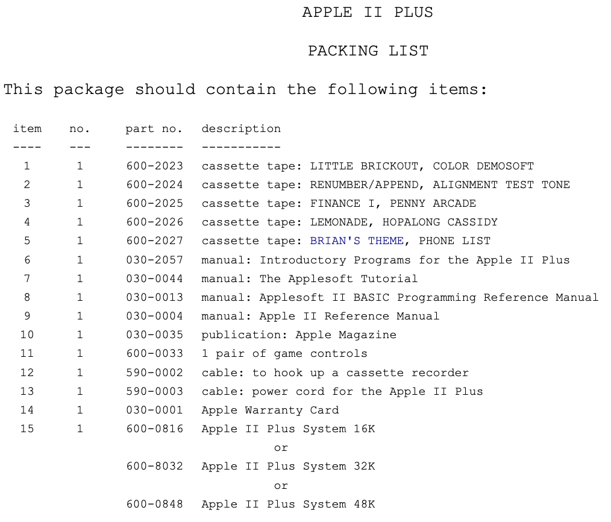

# Part 6: The Apple II Plus

## Hardware 

![An Apple II Plus [1] ](images/apple-ii-plus.jpg)

The introduction of an improved version of Applesoft BASIC in late 1978 began to build into a huge customer demand for this more powerful interpreter. The demand was fueled both by Applesoft's ability to do floating point math (which was needed by those wanting to write and use business and financial applications that needed numbers both to the right as well as to the left of the decimal point) and its inclusion of commands to handle the Apple II's high resolution graphics modes. During 1978, when the improved Applesoft was under development, Apple engineers began work on the Apple II Plus, a modest enhancement to the Apple II. The main attraction of this newer Apple would be Applesoft in ROM, available immediately without having to load it from cassette or disk. Also, having it in ROM would move it out of the part of memory where the RAM-based Applesoft interpreter conflicted with addresses used by the hi-res graphics modes. (Applesoft had commands specifically written into it for manipulating those graphics, something that Integer BASIC could only do via special CALLs to the routines in the Programmer's Aid #1 chip). This evolutionary enhancement to the Apple II was released in June 1979.

With the decision made to upgrade the Apple II, other changes were made to make it more attractive to new computer buyers. The cost of RAM chips had dropped considerably, so most new II Plus systems came standard with a full 48K of RAM. Since the disk operating system consumed about 10K of memory, having the full complement of available RAM made it easier to use the Disk II with either version of BASIC. Since users would not need to add the smaller 4K memory chips, the strapping blocks that had made it possible to use either 4K or 16K RAM chips on the original Apple II were removed.

Small changes had already been made to the product since it first began distribution. Most of these changes were made primarily to simplify it and decrease costs of manufacturing. First of all, the original Apple II motherboard, designated as "Revision 0", was changed to make it possible to display two more colors in hi-res graphics. The Revision 0 board had only four colors (green, violet, black, white), but Wozniak had learned that by making a simple alteration he could get two more colors (blue and orange) and two more varieties of black and white. The Revision 1 and later boards were capable of displaying all eight colors. The means of making this modification to Revision 0 Apples was described by Wozniak in his reply to an article by Allen Watson III about hi-res graphics (in the June 1979 issue of "Byte" magazine). With that change, people who were not afraid of doing a little electrical work on their computers had some of the benefits of an updated Apple II.

Hardware bugs that Apple engineers fixed included one that caused text characters to be displayed with green and violet fringing, whether in graphics mode or text mode. The "color killer" circuit they added fixed things so that non-graphics text would display in black and white only. Another problem involved RAM configurations of either 20K or 24K (a 16K RAM chip plus one or two 4K RAM chips). In those systems a hardware bug caused the 8K of memory from $4000 to $5FFF to be duplicated in the next 8K of memory, from $6000 to $7FFF, whether there was RAM present at those locations or not. This made a 20K Apple appear to have 24K, and a 24K Apple appear to have 36K. The Revision 1 motherboard fixed this problem as well. [2]

Revision 1 boards also modified the cassette input circuit to respond with more accuracy to a weak input signal, making it easier to load data and programs from cassette. Also, one "feature" of the original Apple II was that any sound generated by the internal speaker also appeared as a signal on the cassette output connector; this was fixed in the new motherboards. Lastly, the RESET cycle was made part of the power-up circuitry, eliminating the requirement that the RESET key be pressed after turning on the computer. [3], [4]

## Firmware

More important than the minor hardware changes, however, were the changes in the ROM code. The new ROM replaced the original Monitor with one that, among other things, better supported the new Disk II drive. Since RESET was now automatically activated when the power was turned on, the new ROM code had the computer automatically do a few things. It cleared the screen (displaying "APPLE ][" at the top), and began a scan down the slots, starting at slot 7 down to slot 1. It examined the first few bytes of code in each card's ROM for a specific sequence that identified it as a Disk II controller card. If one was found, control was passed to that card, causing the disk drive to startup and begin loading the disk operating system into memory. If no disk controller was found, the ROM code jumped to the start of BASIC (instead of leaving the user in the Monitor, as in the old ROM). This "Autostart ROM", as it was called, made it possible to have a system that started up a program on the disk with little action needed by the user.

The RESET code was more intelligent in the Autostart ROM than in the Old Monitor ROM. There was now a "Cold Start" RESET (which functioned as described above), and a "Warm Start" RESET. A Warm Start RESET could occur without re-booting the Disk II (if it was present); in fact, it ensured that the disk operating system remained "connected" after RESET was pressed. This feature was implemented by setting three bytes at the end of page $03 in memory. Two of the bytes were the address of the place in memory to which the Apple should jump if RESET was pressed. The third byte was a specially coded byte created from half of the address byte. When RESET was pressed, this special "power-up" byte was checked with the address byte. If they didn't properly match, the Monitor assumed that the power had just been turned on, and it executed a Cold Start RESET. This feature was extensively used by writers of copy protected software, so users could not modify or copy the code in memory simply by pressing the RESET key.

The other major change, mentioned earlier, was the BASIC that was supplied in ROM. Gone was Steve Wozniak's hand-assembled Integer BASIC, in favor of the newer Applesoft. Since these ROM versions of BASIC used the same memory locations, they could not be used simultaneously. With the introduction of the II Plus, Apple also released the Applesoft Firmware Card (also known as the AppleSoft ROM Card). This card, which plugged into slot 0, made it possible for previous Apple II owners to have some of the benefits of the II Plus without having to buy an entirely new computer. Even with that card, however, you could not use features of one BASIC while the other was active, and switching from one BASIC to the other erased any program that was being used at the time. The two BASICs could be told apart by the prompt they used; Integer BASIC used the ">" character, but Applesoft used the "]" character.

![Applesoft ROM Card [5] ](images/applesoft-rom-card.jpg)

Another change made to the Monitor ROM made screen editing easier. The original Apple II's procedure for editing a line typed in BASIC or in the Monitor was tedious at best. To change a line of text in BASIC, you had to list the line, move the cursor up to the start of the line, and then use the right-arrow key to "copy" text from the screen into the input buffer. If you wanted to skip part of the line, you had to move the cursor past the text that you wanted to eliminate "without" using the arrow keys. If you wanted to INSERT something into the line, you had to move the cursor off the line (above it or below it), type the additional text, and then move the cursor back into the line to finish copying the original part of the line. For example, suppose you had typed this line in Applesoft and displayed it on the 40-column screen:

```
]LIST 100
100  FOR I = 1 TO 100: PRINT "I
    LIKE MY APPLE": NEXT : END
]█
```

To change that line so the PRINT statement read "I REALLY LIKE MY APPLE" meant either retyping the entire line, or using the edit feature. (If the line was particularly long, it was preferable to edit rather than retype the entire line). To edit this line, you would have to move the cursor up to the "1" of "100" and begin pressing the right arrow key. When you got to the "L" of "LIKE" you would have to move the cursor above or below the line, type the word "REALLY" followed by a space, then move the cursor back to the "L" of "LIKE", and continue copying with the right arrow key. After editing a line, the screen might look like this:

```
]LIST 100
100  FOR I = 1 TO 100: PRINT "I
    LIKE MY APPLE": NEXT : END█
     REALLY
```

(In this example, I moved the cursor down one line, typed "REALLY", and then moved it back to the start of the word "LIKE"). If you didn't make any mistakes it would read like this:

```
]LIST 100
100  FOR I = 1 TO 100: PRINT "I
    REALLY LIKE MY APPLE": NEXT
    : END
]█
```

However, if you didn't take care to skip over the extra spaces inserted in front of the word "LIKE" by the Applesoft LIST command, it could appear this way:

```
100  FOR I = 1 TO 100: PRINT "I
                REALLY LIKE MY A
    PPLE": NEXT : END
]█
```

The big problem with these cursor moves for editing under the Old Monitor was that each move required two keypresses. To move the cursor up, you had to press "ESC" and then "D" "each time" you wanted to move the cursor up. "ESC A" moved right, "ESC B" moved left, and "ESC C" moved the cursor down. With a long line that needed much editing, this would get old real fast. Not only was it cumbersome, but the layout of the keyboard made it difficult to remember the correct letters used for cursor movement; although "D" (up) was above "C" (down), it seemed that "D" should stand for "Down". Also confusing was that "A" was to the left of "B", but their functions were the opposite of their position!

The new Autostart ROM improved this screen editing process just a bit. Now, pressing "ESC" turned on a special editing mode. Repeated presses of "I" (up), "J" (left), "K" (right), and "M" (down) continued to move the cursor until a key other than ESC was pressed. On the keyboard these letters were arranged in a sort of "directional keypad" or diamond, which made remembering the moves a little easier. The previous ESC editing codes were still supported, but still with their previous limitations. Unfortunately, however, you still couldn't tell whether you were in the regular text entry mode or in the ESC editing mode, and often attempts at changing a line took several tries to get it right. [6], [7]

Other features added in the new Autostart ROM included the ability to pause a listing by pressing Ctrl-S ("very" helpful when trying to scan through a long program!) As mentioned above, pressing RESET would return control through the soft-entry vectors on memory page $03. This would allow a user to exit from a runaway BASIC program by pressing RESET, and still keep program and variables intact in memory (which could not be guaranteed with the old Monitor ROM). [7]

John Arkley at Apple wrote the changes to the original Monitor ROM and created the Autostart ROM in November 1978 (he's the "John A" mentioned in the source code listing found in the 1981 edition of the "Apple II Reference Manual"). After Arkley had done the work and the ROMs had been created, Apple began working on a new version of the Reference Manual to cover the Apple II Plus. The older Reference Manual (affectionately known as the "Red Book") had included an assembly language source code listing of the Monitor ROM. They wanted to include the source for "both" versions of the Monitor, but a problem came up. While developing the Monitor, Apple had used a local mainframe computer dial-up service known as "Call Computer." They used a cross-assembler on that computer, assembled the code, and then used the resulting object code to create the ROM. (A cross-assembler is a program that creates object code for a processor other than the one the cross-assembler runs on. For example, if you can write 8080 machine code with an assembler running on a 6502-based computer, you are using a cross-assembler). Unfortunately, Call Computer had accidentally done a system backup with the source and destination disks reversed, erasing all the files containing the source code for the Apple II Monitors. There were no disk or cassette copies of the source code for the Autostart ROM back at Apple. Working from the source listing in the Red Book, John recreated the source file for the original Monitor, and then disassembled his own modifications for the II Plus and re-created his Autostart ROM source file. Those reconstructed listings are what appeared in the 1981 edition of the Apple II Reference Manual. [8]

Not everyone was pleased with the modifications made in the Autostart ROMs, however. Some of the authors of the magazine Call-A.P.P.L.E. liked to refer to the new computer as the "Apple II Minus", since Arkley had to remove some of their beloved routines from the ROMs to make room for the new features. Missing from the Apple II Plus ROMs were Integer BASIC, the miniassembler, and Woz's SWEET 16 interpreter (that entire space now being used by Applesoft). Missing from the Monitor were the assembly language STEP and TRACE features, and a set of sixteen-bit multiply and divide routines. [7]

## Cost

The new Apple II Plus, at $1,195, sold for over $100 less than the original Apple II, although it came with more memory and had Applesoft (previously an added expense item) in ROM.

## Bell & Howell

Apple made a marketing deal early on with Bell & Howell to let them sell the Apple II Plus with a Bell & Howell name plate on it for use in schools. Bell & Howell had long been associated with education institutions through their sturdy movie projectors and other audio-visual equipment, which were used extensively by schools throughout the United States. The Apple II's sold through Bell & Howell were black colored (instead of the standard beige), earning them the nickname among computer hobbyists as the "Darth Vader" Apple II's (due to the color similarity with the "Star Wars" villain). These computers came with screws on the back to keep the lids on, specifically in order to comply with UL certification, which was often a requirement for equipment sold to schools. A typical Apple II Plus could not be certified as such, since it was "designed" to function with the lid off, which provided access to the internal components and, potentially, electric shock.

![The "Darth Vader" Apple II Plus by Bell & Howell [9] ](images/apple-ii-plus-bell-and-howell.jpg) 

One model of the Bell & Howell Apple II Plus, Model A2S1048B, had an optional "backpack" attached to the rear of the computer. This backpack provided support for a coaxial cable to be attached for video output to the monitor (as well as the standard RCA phono jack for video), three 110 volt power outlets for peripherals, a carrying handle, three audio-in jacks, an audio-out jack, a standard 1/4 inch headphone jack, as well as the standard cassette input/output jacks. The power cord was quite long. Another model, A2S1032B, did not come with the backpack option. [20], [21] These computers also came with the "shift-key mod" (see below) already applied.

!["Backpack" on Bell & Howell Apple II Plus [10] ](images/apple-ii-plus-bell-and-howell-back.jpg) 

This version of the Apple II Plus could be purchased with Disk II drives that were colored the same black as the computer. Bell & Howell also sold a printer called the P-100, which was actually a renamed MPI model 99G with a Centronics-compatible parallel interface cable (directly attached to the printer), and a parallel printer card. [21]

Through their association with Bell & Howell, Apple had the means of getting a foothold in the school environment. [11], [12]

Bell & Howell also had electronics correspondence courses, and used the black Apple II Plus for one of their courses. They offered a one year warranty, instead of the ninety-day warranty offered by Apple. [14], [15], [16]

## Early User Experiences

An Apple II veteran on GEnie, Dennis Ulm, kindly provided me with the following reproduction of his "original" Apple II Plus packing list. It gives a little picture of what early non-disk users had to work with:

 

(LITTLE BRICKOUT was an abbreviated Applesoft version of Woz's Integer BASIC Breakout game (the reason he designed the Apple II in the first place). BRIAN'S THEME was a hi-res graphics program that drew lines on the screen in various patterns:

![Screenshot of Brian's Theme demo [13] ](images/brians-theme.png) 

HOPALONG CASSIDY was a "guess who" program that also used the hi-res screen). [17], [18]

Also included in Dennis' II Plus box was this photocopied instruction sheet:

```
TAPE LOADING INSTRUCTIONS

If problems are encountered in LOADing tape programs, it may be necessary to "queue" (sic) the tape before LOADing. To queue a tape, use the following procedure:

1. Rewind the tape.

2. Disconnect the cable from the tape recorder (so you can hear what's on the tape).

3. Start the tape recorder in PLAY mode.

4. When a steady tone is heard, STOP the tape recorder.

5. Connect the cable to the tape recorder and adjust the volume and tone controls on the tape recorder to the recommended levels.

6. Make sure your computer is in BASIC.

7. Type LOAD.

8. START the tape playing.

9. Press RETURN. The program should LOAD properly. If an error message occurs, repeat the procedure, but try readjusting the tone and volume controls on the tape recorder.
```

Dennis says that in his experience it took at least five to ten tries to get anything to load properly from tape!

## More Hardware Add-Ons

Lower-case was still not supported on the new Apple II Plus, though it was a popular user-modification. The thriving industry for Apple II peripherals made up for this shortcoming, with various vendors supplying small plug-in circuit boards that fit under the keyboard, allowing display of lower-case on the screen (and sometimes direct entry of lower-case from the keyboard). By 1981, when the Revision 7 motherboard was released for the Apple II Plus, a different method of character generation was used, which reduced radio-frequency interference that was generated. For Revision 7 boards, lower-case characters could be displayed with the addition of only a single chip. However, unless a user changed the keyboard encoder with a third-party product, only upper-case characters could be typed. [19]

The keyboard itself underwent some changes, both by users and by Apple. The original RESET key was in the upper right-hand corner of the keyboard. The problem with that key was that it had the same feel as the keys around it, making it possible to accidentally hit RESET and lose the entire program that was being so carefully entered. One user modification was to pop off the RESET keycap and put a rubber washer under it, making it necessary to apply more pressure than usual to do a RESET. Apple fixed this twice, once by replacing the spring under the keycap with a stiffer one, and finally by making it necessary to press the CTRL key and the RESET together to make a RESET cycle happen. The keyboards that had the CTRL-RESET feature made it user selectable via a small slide switch just inside the case (some people didn't want to have to press the CTRL key to do a RESET).

Another keyboard limitation was addressed through a modification that became known as the "shift-key mod". This was such a widely used trick that Apple ended up supporting it in hardware when they designed the Apple IIe. Since the II and II Plus keyboards could not directly generate lower-case characters, early word processing programs had to find some way to make up for that deficiency. Apple's own Apple Writer program used the ESC key as a shift and shift-lock key, displaying upper-case characters in inverse video and lower-case in regular video. Other programs suggested installing the shift-key mod to allow more natural entry of upper-case, using the SHIFT key already present on the keyboard. The user had to attach a wire to the contact under the SHIFT key, and run it to the game port where the input for push-button 2 was found. (This push-button PB2, $C063 in memory, was for one of an optional second pair of game paddles that third-party hardware companies supplied for the Apple II). The program would assume that all letters being typed were in lower-case, unless the SHIFT key (attached now to paddle button PB2) was also being pressed; in that case the letter would be entered as upper-case. Since the PB2 button was not often used for a second pair of game paddles, it was unlikely that this modification would be accidentally triggered by pressing one of the game paddle buttons. This modification did "not" use buttons PB0 or PB1, which were on the first pair of game paddles. (In the later models of the Apple II, including the IIe, the IIc, and the IIgs, PB0 and PB1 were made to correspond to the Open-Apple and Solid-Apple/Option keys on either side of the space bar).

## Timeline

The start and end dates for each model of the Apple-1, Apple II and II Plus:

* Apple-1 - April 1976 - Mar 1977
* Apple II - April 1977 - May 1979
* Apple II Plus - June 1979 - December 1982

## Notes

* [1] Photo: An Apple II Plus. [Wikimedia Commons](https://commons.wikimedia.org/wiki/File:Apple_II_Plus_cropped.jpg).
* [2] -----. "Memory Organization", Apple II Reference Manual, Cupertino, CA, Apple Computer, Inc., 1979, 1981: 70-73.
* [3] -----. Apple II Reference Manual: 25-27, 34-36.
* [4] Field, Bruce. "A.P.P.L.E. Doctor", Call-A.P.P.L.E., Jan 1984: 74-75.
* [5] Photo: Applesoft ROM Card. [Source](https://www.applefritter.com/content/early-apple-ii).
* [6] -----, "Apple and Apple II History", The Apple II Guide, Cupertino, CA, Apple Computer, Inc., Fall 1990: 9-16.
* [7] -----. Apple II Reference Manual: 25-27, 34-36.
* [8] Arkley, John. Telephone interview. Sep 9, 1991.
* [9] Photo: The "Darth Vader" Apple II Plus by Bell & Howell. [Wikimedia Commons](https://en.wikipedia.org/wiki/File:Bell_and_Howell_Apple_II.jpg).
* [10] Photo: "Backpack" on Bell & Howell Apple II Plus. [Oldcomputers.net](http://oldcomputers.net/bellandhowell.htm).
* [11] Regan, Joe. GEnie A2 Roundtable, Category 2, Topic 16, Apr 1991.
* [12] Paymar, Dan. "Curing A Shiftless Apple", Call-A.P.P.L.E., May 1982: 63-64.
* [13] Screenshot of Brian's Theme demo. [Youtube](https://www.youtube.com/watch?v=-tqgcYW6Ewk).
* [14] Vanderpool, Tom. GEnie A2 Roundtable, Category 2, Topic 16, Mar & Aug 1991.
* [15] Zuchowski, Tom. GEnie A2 Roundtable, Category 2, Topic 16, Mar 1991.
* [16] Hirsch, Steve. GEnie A2 Roundtable, Category 2, Topic 16, Mar 1991.
* [17] Ulm, Dennis. GEnie A2 Roundtable, Category 2, Topic 16, Apr 1991.
* [18] Felty, Wes. GEnie. A2 Roundtable, Category 2, Topic 16, Apr 1991.
* [19] Field, Bruce. "A.P.P.L.E. Doctor", Call-A.P.P.L.E., Jan 1984: 74-75.
* [20] Additional Bell & Howell info from J Mayrand's Computer Museum.
* [21] Villados, Brian. "Apple II Plus - Bell & Howell Model". [The World According To... The Mac Geek](http://www.macgeek.org/museum/bhapple2plus/index.html),  (Dec 2002).
