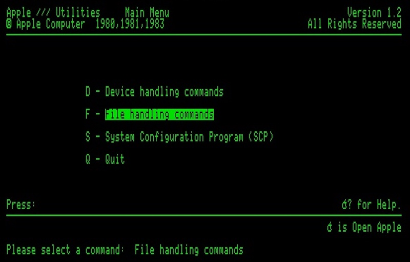
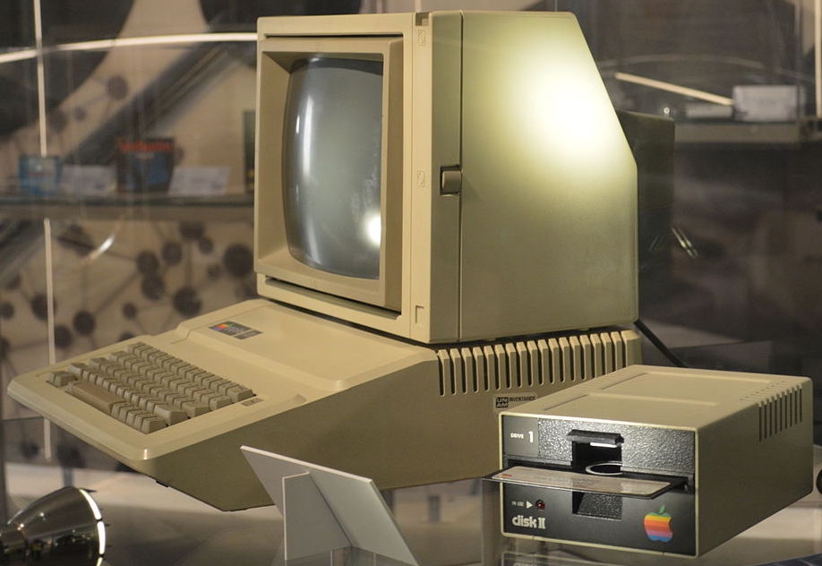
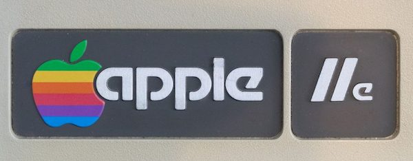
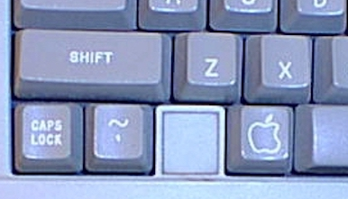
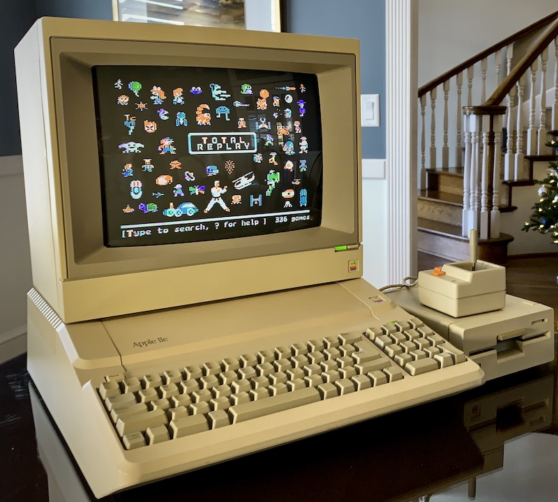
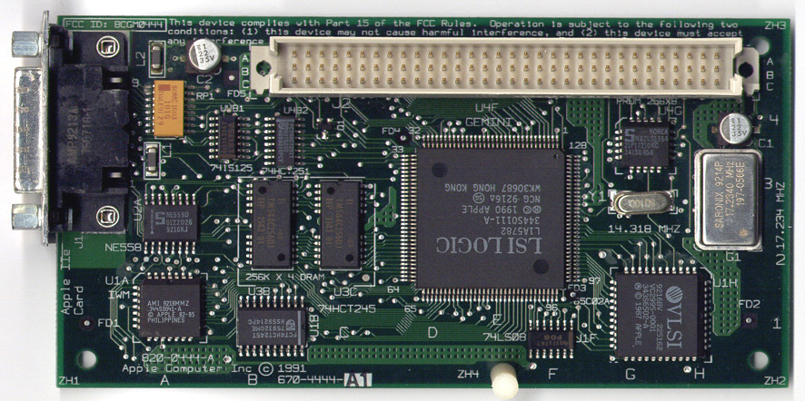
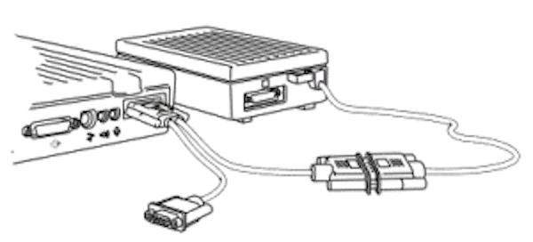

# Apple II History -- Part 7: The Apple IIe

## The Apple III Project

Between the years 1979 and 1983, although no new versions of the Apple II were released, it enjoyed a broad popularity and annually increasing sales. The open architecture of the computer, with its fully described hardware and firmware function via the Reference Manual, made it appealing both to hardware and software hackers. Third-party companies designed cards to plug into the internal slots, and their function varied from making it possible to display and use 80-column text, to clocks and cards allowing the Apple II to control a variety of external devices. During this time there was also an explosion of new software written for this easily expandable machine, from the realm of business (VisiCalc and other spreadsheet clones), to utilities, to games of all types. Each month a host of new products would be available for those who wanted to find more things to do with their computer, and the Apple II was finding a place in the home, the classroom, and the office.

At Apple Computer, Inc., however, the Apple II was not viewed with the same degree of loyalty. Although it had continued to be a sales leader, there were sentiments within the company as early as September, 1979 that it was unlikely the II could continue to be a best seller for more than another year or two. Since Apple Computer was a business, and not just a vehicle for selling the Apple II computer, they began to enlarge the engineering department to begin designing new products. [1] The beginning of these new design efforts began in 1978, and one of the earliest projects was an enhanced Apple II that used some custom chips; however, that project was never finished. They also began work on a different, more powerful computer that would use several identical microprocessor chips sharing tasks. The main advantage would be speed, and the ability to do high precision calculations. This computer was code-named Lisa, and because it was such a revolutionary type of design, they knew it would take many years to come to actual production. Because of the power it was to have, Apple executives felt that Lisa would be the future of the company. [2], [14]

Because they knew that the Lisa project would take a long time to complete, and because the Apple II was perceived to have only a short remaining useful life as a product, they began a new computer project called the Apple III. Instead of building upon the Apple II as a basis for this new computer, they decided to start from scratch. Also, although Wozniak made most of the design decisions for the II, a committee at Apple decided what capabilities the Apple III should have. They decided that the Apple III was to be a "business" machine, and not have the home or arcade-game reputation that the II had. It was to have a full upper/lowercase keyboard and display, 80-column text, and a more comprehensive operating system. They also decided that since it would be a while before many application programs would be available for this new computer, it should be capable of running existing Apple II software. In some ways this handicapped the project, since it was then necessary to use the same microprocessor and disk drive hardware as was used in the Apple II. [3]

Apple executives also decided that with the introduction of the Apple III they wanted a clear separation between it and the Apple II in regard to marketing. They did not want "any" overlap between the two. The III would be an 80-column business machine and was predicted to have ninety percent of the market, while the Apple II would be a 40-column home and school machine and would have ten percent of the market. Apple's executives were confident that after the release of the Apple III, the Apple II would quickly lose its appeal. [4]

Because of their desire for a strong and distinct product separation, the Apple II emulation mode designed into the Apple III was very limited. The engineers actually "added" hardware chips that prevented access to the III's more advanced features from Apple II emulation mode. Apple II emulation couldn't use 80 columns, and had access to only 48K memory and none of the better graphics modes. As a result, it wouldn't run some of the better Apple II business software, during a time when there wasn't much "new" business software for the Apple III.

The Apple III engineers were given a one year target date for completion. It was ready for release in the spring of 1980, but there were problems with both design and manufacturing. (It was the first time that Apple as a company tried to come out with a new product; the Apple II had been designed and built by Wozniak when he "was" the engineering department). The first Apple III computers were plagued with nearly 100% defects and had to be recalled for fixes.[15] Despite the efforts that Apple took to fix these problems, even taking the unprecedented step of repairing "all" of the defective computers at no charge, they never recovered the momentum they lost with that first mistake, and the III did not become the success Apple needed it to be.[3]

Although all of the bugs and limitations of the Apple III were eventually overcome, and it became the computer of choice within Apple, it did not capture the market as they had hoped. At that point, they weren't sure exactly what to do with the II. They had purposely ignored and downplayed it for the four years since the II Plus was released, although without its continued strong sales they would not have lasted as a company. In a 1985 interview in "Byte" magazine, Steve Wozniak stated:

> When we came out with the Apple III, the engineering staff cancelled every Apple II engineering program that was ongoing, in expectation of the Apple III's success. Every single one was cancelled. We really perceived that the Apple II would not last six months. So the company was almost all Apple III people, and we worked for years after that to try and tell the world how good the Apple III was, because we "knew" [how good it was]... If you looked at our advertising and R&D dollars, everything we did here was done first on the III, if it was business related. Then maybe we'd consider doing a sub-version on the II. To make sure there was a good boundary between the two machines, anything done on the II had to be done at a lower level than on the III. Only now are we discovering that good solutions can be implemented on the II... We made sure the Apple II was not allowed to have a hard disk or more than 128K of memory. At a time when outside companies had very usable schemes for adding up to a megabyte of memory, we came out with a method of adding 64K to an Apple IIe, which was more difficult to use and somewhat limited. We refused to acknowledge any of the good 80-column cards that were in the outside world--only ours, which had a lot of problems. [4]

Wozniak went on in that interview to say that at one time he had written some fast disk routines for the Pascal system on the Apple II, and was criticized by the Apple III engineers. They didn't think that anything on the II should be allowed to run faster than on a III. That was the mindset of the entire company at the time.

Apple has been much maligned for the attention they gave the Apple III project, while suspending all further development on the Apple II. They pegged their chances for the business market in 1980 on the Apple III. Even Steve Wozniak had stated in another interview, "We'd have sold tons of [computers in the business market] if we'd have let the II evolve ... to become a business machine called the III instead of developing a separate, incompatible computer. We could have added the accessories to make it do the business functions that the outside world is going to IBM for."[3] Part of the problem was the immaturity of the entire microcomputer industry at the time. There had "never" been a microcomputer that had sold well for more than a couple of years before it was replaced by a more powerful model, usually from another company. The Altair 8800 and IMSAI had fallen to the more popular and easier to use Apple II and TRS-80 and Commodore PET, as well as other new machines based on the Intel 8080 and 8088 processors. It is entirely understandable that Apple's attitude between 1978 and 1980 would be of panic and fear that they wouldn't get a new computer out in time to keep their market share and survive as a company. However, during the entire time when Apple was working on the III as a computer to carry the company through until Lisa would be ready, and during the entire time that the Apple II was ignored by its own company, it continued to quietly climb in sales. It is a credit to both the ingenuity of Wozniak in his original design, and to the users of the Apple II in "their" ingenuity at finding new uses for the II, that its value increased and stimulated yet more new sales. The Apple II "beat" the odds of survival that historically were against it.

## The Apple IIe: Beginnings

When Apple saw that the sales on the Apple II were "not" going to dwindle away, they finally decided to take another look at it. The first new look at advancing the design of the II was with a project called "Diana" in 1980. Diana was intended primarily to be an Apple II that had fewer internal components, and would be less expensive to build. The project was later known as "LCA", which stood for "Low Cost Apple". Inside Apple this meant a lower cost of manufacturing, but outsiders who got wind of the project thought it meant a $350 Apple II. Because of that misconception, the final code name for the updated Apple II was "Super II", and lasted until its release.[5] (Click on this link for a picture and description of a prototype for the Super II.)

## Hardware

Part of the IIe project grew out of the earlier work on custom integrated circuits for the Apple II. When they finally decided to go ahead and improve the design by adding new features, one of the original plans was to give the Apple II an 80-column text display and a full upper/lowercase keyboard. Walt Broedner at Apple did much of the original hardware planning, and was one of those at Apple who pushed for the upgrade in the first place. To help maintain compatibility with older 40-column software (which often addressed the screen directly for speed), he decided to make 80-columns work by mirroring the older 40 column text screen onto a 1K memory space parallel to it, with the even columns in main memory and the odd columns in this new "auxiliary" memory. To display 80-column text would require switching between the two memory banks. Broedner realized that with little extra effort he could do the same for the entire 64K memory space and get 128K of bank-switchable memory. They put this extra memory (the 1K "80-column card", or a 64K "extended 80-column card") in a special slot called the "auxiliary" slot that replaced slot 0 (the 16K Language Card was going to be a built-in feature). The 80-column firmware routines were mapped to slot 3, since that was a location commonly used by people who bought 80-column cards for their Apple II's, and was also the place where the Apple Pascal system expected to find an external terminal. The auxiliary slot also supplied some special video signals, and was used during manufacture for testing on the motherboard.

The engineers that worked on the IIe tried hard to make sure that cards designed for the II and II Plus would work properly in the new computer. They even had to "tune" the timing on the IIe to be slightly "off" (to act more like the II Plus) because the Microsoft Z-80 Softcard refused to function properly with the new hardware. A socket was included on the motherboard for attaching a numeric keypad, a feature that many business users had been adding (with difficulty) to the II Plus for years. The full keyboard they designed was very similar to the one found on the Apple III, including two unique keys that had first appeared with the III--one with a picture of an hollow apple ("open-apple") and the other with the same apple picture filled in ("solid-apple"). These keys were electrically connected to buttons 0 and 1 on the Apple paddles or joystick. They were available to software designers as modifier keys when pressed with another key; for example, open-apple-H could be programmed to call up a "help" screen. The newer electronics of the keyboard also made it easier to manufacture foreign language versions of the Apple IIe. [6]

Overall, Broedner and Peter Quinn (the design manager for the IIe and later the IIc projects) and their team managed to decrease the number of components on the motherboard from over one hundred to thirty-one, while adding to the capabilities of the computer by the equivalent of another hundred components.

## Fireware

Peter Quinn had to beg for someone to help write the firmware revisions to the Monitor and Applesoft for the IIe. He finally got Rich Auricchio, who had been a hacker on the Apple II almost from the beginning. Quinn said in a later interview, "You cannot get someone to write firmware for this machine unless he's been around for three or four years. You have to know how to get through the mine field [of unofficial but commonly used entry points]. He [Rick] was extremely good. He added in all the 80-column and Escape-key stuff." Quinn also got Bryan Stearns to work on the new Monitor. [6] [7]

Changes were made in the ROMs to support the new bank-switching modes made necessary by having two parallel 64K banks of RAM memory. To have enough firmware space for these extra features, the engineers increased the size of the available ROM by making "it" bank-switched. This space was taken from a location that had previously not been duplicated before--the memory locations used by cards in the slots on the motherboard. Ordinarily, if you use the Monitor to look at the slot 1 memory locations from $C100 through $C1FF, you get either random numbers (if the slot is empty), or the bytes that made up the controller program on that card. Any card could also have the space from $C800 through $CFFF available for extra ROM code if they needed it. If a card in a slot did a read or write to memory location $CFFF, the $C800-$CFFF ROM that belonged to that card would appear in that space in the Apple II memory. When another card was working, then "its" version of that space would appear. On the IIe, they made a special soft-switch that would switch "out" all the peripheral cards from the memory, and switch "in" the new expanded ROM on the motherboard. The firmware in the new bank-switched ROM space was designed to avoid being needed by any card in a slot (to avoid conflicts), and much of it was dedicated to making the 80-column display (mapped to slot 3) work properly.

Also added were enhancements to the ESC routines used to do screen editing. In addition to the original ESC A, B, C, and D, and the ESC I, J, K, and M added with the Apple II Plus, Auricchio added the ability to make the ESC cursor moves work with the left and right arrow keys, and the new up and down arrow keys. The new IIe ROM also included a self-test that was activated by pressing both apple keys, the control key, and RESET simultaneously. [5]

## Success

The new Apple IIe turned out to be quite profitable for Apple. Not only was it more functional than the II Plus for a similar price, but the cost to the dealers selling it was about three times the cost of manufacture. They had gotten their "Low Cost Apple", and by May of 1983 the Apple IIe was selling sixty to seventy thousand units a month, over twice the average sales of the II Plus. Christmas of 1983 saw the IIe continue to sell extremely well, partly resulting from the delayed availability of the new IBM PCjr. Even after the Apple IIc was released in 1984, IIe sales continued beyond those of the IIc, despite the IIc's built-in features. [8]

## Modifications

Early Apple IIe motherboard's were labelled as "Revision A". Engineers determined soon after its introduction that if the same use of parallel memory was applied to the hi-res graphics display as was done with the text display, they could create higher density graphics. These graphics, which they called "double hi-res", also had the capability of displaying a wider range of colors, similar to those available with the original Apple II lo-res graphics. The IIe motherboards with the necessary modifications to display these double hi-res graphics were labelled "Revision B", and a softswitch was assigned to turning on and off the new graphics mode.

Later versions of the IIe motherboards were again called "Revision A" (for some reason), although they "had" been modified for double hi-res graphics. The difference between the two "Revision A" boards was that the latter had most of the chips soldered to the motherboard. An original "Revision A" board that had been changed to an Enhanced IIe was not necessarily able to handle double hi-res, since the change to the Enhanced version involved only a four-chip change to the motherboard, but not the changes to make double hi-res possible. [9]

## The Enhanced IIe

This version of the Apple IIe was introduced in March of 1985. It involved changes to make the IIe more closely compatible with The Apple IIc and II Plus. The upgrade kit (for previous IIe owners) consisted of four chips that were swapped in the motherboard: The 65c02 processor, with more assembly language opcodes, replaced the 6502; two more chips with Applesoft and Monitor ROM changes; and the fourth a character generator ROM that included graphics characters (first introduced on the IIc) called "MouseText". The Enhanced IIe ROM changes fixed most of the known problems with the IIe 80-column firmware, and made it possible to enter Applesoft and Monitor commands in lower-case. The older 80-column routines were slower than most software developers wanted, they disabled interrupts for too long a time, and there were problems in making Applesoft work properly with the 80-column routines. These problems were solved with the newer ROMs.

For those who purchased the Enhanced IIe new, there were modifications to the appearance of the keyboard, including a darker color to the keys, a smaller size to the characters on the keys, a change to black color for that text, and movement of the character to the upper part of the key. Also, the power light had the word "Enhanced" added to it, to help distinguish it from the original Apple IIe. (This sticker was also included in the upgrade kit). 

Monitor changes also included a return of the mini-assembler, absent since the days of Integer BASIC. It was activated by entering a "!" command in the Monitor, instead of a jump to a memory location as in the older Apple II. Also added were an "S" command was added to make it possible to search memory for a byte sequence, and the ability to enter ASCII characters directly into memory. However, the "L" command to disassemble 6502 code still did not handle the new 65c02 opcodes as did the IIc disassembler. Interrupt handling was also improved.

Applesoft was fixed to let commands such as GET, HTAB, TAB, SPC, and comma tabbing work properly in 80-column mode.

The new MouseText characters caused a problem for some older programs at first, until they were upgraded; characters previously displayed as inverse upper-case would sometimes display as MouseText instead. [10], [11]

## The Platinum IIe

This version of the IIe, introduced in January 1987, had a keyboard that was the same as the IIGS keyboard, but the RESET key was moved above the ESC and "1" keys (as on the IIc), and the power light was above the "/" on the included numeric keypad (the internal numeric keypad connector was left in place). The CLEAR key on the keypad generated the same character as the ESC key, but with a hardware modification it could generate a Ctrl-X as it did on the IIGS. The motherboard had 64K RAM in only two chips (instead of the previous eight), and one ROM chip instead of two. An "extended 80-column card" with 64K extra memory was included in all units sold, and was smaller than previous versions of that memory card.

No ROM changes were made. The old shift-key modification was installed, making it possible for programs to determine if the shift-key was being pressed. However, if using a game controller that actually used the third push-button (where the shift-key mod was internally connected), pressing shift and the third push-button simultaneously caused a short circuit that shut down the power supply. [12]

## IIe Emulation

In early 1991, Apple introduced a hardware add-on card for the Macintosh LC computer (the first low cost Mac that could display color [16]) which allowed it to emulate an 128K Apple IIe. This Apple IIe-on-a-card cost only $199, but the Mac LC needed to use the card sold for $2,495, which made the combination the most expensive Apple II ever made. Apple engineers managed to put the function of an entire IIe onto a card "smaller" than the old Disk II controller card. With version 2.0 of the Apple II interface software (which ran on the Mac and accessed the features of the card), more of the memory allocated to the Macintosh could be used by the IIe. However, unlike all previous versions of the IIe, there were no hardware-based slots on the IIe card; instead, it used software-based slots that were allocated by moving icons that represent various peripherals into "slots" on the Mac screen.

To use 5.25 disks with this Apple IIe, there was a cable that attached to the card. The cable would split into a game connector (for paddles or joystick operation) and a connector that accepted IIc and IIGS style 5.25 drives. The IIe card ran at a "normal" (1 MHz) speed and a "fast" (2 MHz) speed. [13] It had limitations, however. For a 1991 Apple II, it was limited in being unable to be accelerated beyond 2 MHz (a Zip Chip could run a standard IIe at 8 MHz), and the screen response seemed slow, since it was using a software-based Mac text display instead of the hardware-based Apple II character ROM. As a Macintosh it lacked the power and speed of the newer Macintosh II models (which also ran color displays). But if having a Apple II and a Mac in one machine was important, this was the best way to do it. This card lasted longer than the "real" Apple IIe, not being discontinued until May 1995.

## Notes

* [1] Freiberger, Paul, and Michael Swaine. "Fire In The Valley, Part I (Book Excerpt)", A+ Magazine, Jan 1985: 45-48.
* [2] Freiberger, Paul, and Swaine, Michael. "Fire In The Valley, Part II (Book Excerpt)", A+ Magazine, Jan 1985: 46,51.
* [3] Rubin, Charles. "The Life & Death & Life Of The Apple II", Personal Computing, Feb 1985: 72.
* [4] Williams, Gregg, and Rob Moore. "The Apple Story, Part 2: More History And The Apple III", Byte, Jan 1985: 177-178.
* [5] Tommervik, Al. "Apple IIe: The Difference", Softalk, Feb 1983: 118-127, 142.
* [6] Williams, Gregg. "'C' Is For Crunch", Byte, Dec 1984: A75-A78, A121.
* [7] Little, Gary. Inside The Apple //c. Bowie, Maryland, Brady Communications Company, Inc., 1985: 1-7.
* [8] Rose, Frank. West Of Eden: The End Of Innocence At Apple Computer. New York, Penguin Books, 1989: 98-99.
* [9] Weishaar, Tom. "Ask Uncle DOS", Open-Apple, Dec 1986: 2.86.
* [10] Weishaar, Tom. "A Song Continued", Open-Apple, Mar 1985: 1.20-1.21.
* [11] Weishaar, Tom. "Demoralized Apple II Division Announces Enhanced IIe...", Open-Apple, Apr 1985: 1.25-1.27.
* [12] Weishaar, Tom. "Apple Introduces An Updated IIe", Open-Apple, Jan 1987: 3.1.
* [13] Doms, Dennis. "The Apple II as Mac peripheral", Open-Apple, Jul 1991: 7.43-7.44.
* [14] This was an early version of the Lisa project. When the 68000 microprocessor became available from Motorola, it was decided to use that as a single processor for the Lisa. Also, Jef Raskin (one of Apple's early employees) encouraged the Lisa team to visit the Xerox Palo Alto Research Center (PARC) and see the Xerox Star computer with its bit-mapped screen, icon interface and mouse pointing device. After Steve Jobs saw these wonders, he pushed strongly for the Lisa to work in that way.
* [15] One of the problems with the Apple III involved heat production, which caused the integrated circuit chips in sockets to work themselves loose. Apple's solution even told some customers that a solution they could use was to lift the computer several inches up from the desktop, and then drop it, thus re-seating the chips!
Slabihoud's excellent 8-Bit Museum (in German).
* [16] The first Macintosh to be able to display color was the Macintosh II, released in 1987 at a base price of $3898! The Macintosh LC appeared in October 1990, at a more reasonable (?) cost of $2400, and was specifically targeted to the home user. Thanks to Ernest Allen for correcting the original statement that the Mac LC was the first color Macintosh. References from www.apple-history.com.
--
Steven Weyhrich
v2.1  27 Jun 03